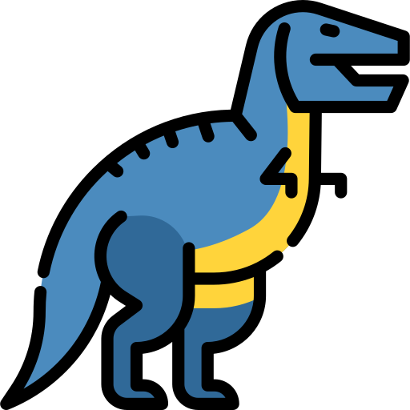

# dinosay


_dinosay_ is a humble, simple, nice and paleolithic alternative to [_cowsay_](https://en.wikipedia.org/wiki/Cowsay).

> The status of this project is: **Work in progress: _alpha_ version**

## How did the idea come about?

The idea came from my two children. 
To make them learn the syllables and then how to assemble them to form words, 
I used cowsay on my terminal, so that they learned while having fun.
One day, they asked me: "Dad, isn't there a way to make a dinosaur talk too?" (both are dinosaur fans, like me).
So I used `cowsay -f ~/dinosaur.cow`, but I made a very simple one.
The next day, I thought about how to reproduce it in python (my primary programming language) and opened this project.

### Differences

_dinosay_ is an alternative and not a replacement. The library is not meant to be cowsay's rewrite. 
If you are looking for this then you need to go to [pycowsay](https://github.com/cs01/pycowsay).

### Features

_dinosay_ implements most of the functionality of cowsay, adding freedom in the individual elements. 
For example, you can add the _tongue_ element or replace the eyes by specifying the _eye_ parameter. 
If you have suggestions or new implementations, or you are an ASCII designer and would like your template to be added 
to the dinosaur library, open an _issue_ using the _dinosay-enhancement_ issue template, 
attaching your creation if possible. Below you will find instructions for building your template.

## Installation

Unlike its cousin cowsay, _dinosay_ is written in python.

_dinosay_ can be used on the command line or as a python module, to give a dinosaur touch!

For install package, see below:

```console
$ pip install dinosay       # for python enviroment
$ dnf install dinosay.rpm   # for Red Hat, CentOS and fedora
$ yast -i dinosay.rpm       # for SLES and OpenSUSE

# for debian based and ubuntu based, see here
$ apt-get install alien
$ alien -i dinosay.rpm

# for other
$ git clone https://github.com/MatteoGuadrini/dinosay.git && cd dinosay
$ python setup.py install
```

## Command line

From the command line, _dinosay_ looks like this:

```console
$ dinosay --help
usage: dinosay [-h] [--version] (-d DINOSAUR | -r | -f FILE | -l) [-c COLOR] [-b BEHAVIOR] [-i]
               [-t] [-e EYE] [-w WRAP]
               [message]

print messages via ASCII dinosaurs

positional arguments:
  message               message to print

optional arguments:
  -h, --help            show this help message and exit
  --version, -v         show program's version number and exit
  -d DINOSAUR, --dinosaur DINOSAUR
                        dinosaur to print
  -r, --random          random dinosaur to print
  -f FILE, --file FILE  file containing ASCII to print
  -l, --list            list of all dinosaurs and parts
  -c COLOR, --color COLOR
                        color dinosaur
  -b BEHAVIOR, --behavior BEHAVIOR
                        behavior of dinosaur
  -i, --idea            idea's speech bubble
  -t, --tongue          shape of the tongue
  -e EYE, --eye EYE     shape of the eye
  -w WRAP, --wrap WRAP  length of the message

 _____     __     __   __     ______     ______     ______     __  __   
/\  __-.  /\ \   /\ "-.\ \   /\  __ \   /\  ___\   /\  __ \   /\ \_\ \  
\ \ \/\ \ \ \ \  \ \ \-.  \  \ \ \/\ \  \ \___  \  \ \  __ \  \ \____ \ 
 \ \____-  \ \_\  \ \_\\"\_\  \ \_____\  \/\_____\  \ \_\ \_\  \/\_____\
  \/____/   \/_/   \/_/ \/_/   \/_____/   \/_____/   \/_/\/_/   \/_____/ 
```

## Python module

Instead, using it as a python module, we'll do it like this:

```python
from dinosay import dinoprint, DINO_TYPE
msg = "Hi, I'm dinosay!"
dinoprint(msg, DINO_TYPE['tyrannosaurus'])
```

## Custom template

If you want to build a custom template to parse to cowsay's _file_ parameter, then you should follow these guidelines.

The template will have to use ASCII characters, and can use some substitution variables. 
The variables are included in this table:

Name   | Description
------ | -----------
$comic | Variable indicating the positioning of the message to be printed. IMPORTANT! if it is missing, the message will NOT be printed.
$eyes  | Variable indicating the substitution characters of the eyes. The pattern must be the following: `character-space-character`. 
$eye   | Same as _$eyes_ but only prints the first character, so it represents a single eye. 
$tongue| Variable indicating language substitution characters. It can be single, or multiple, for example `\_\`. 


### Simple template example

This is a simple template:

```console
$ cat <<EOF >> /tmp/trex.ascii

$comic
                                        O_
                                       /  >
                                      -  >   ^\
                                     /   >  ^ /   
                                    ($eye)  > ^ /   / / /  
       _____                        |            \\|//
      /  __ \                      _/      /     / _/
     /  /  | |                    /       /     / /
   _/  |___/ /                  _/      ------_/ / 
 ==_|  \____/                 _/       /  ______/
     \   \                 __/           |\
      |   \_          ____/              / \      _                    
       \    \________/                  |\  \----/_V
        \_                              / \_______ V
          \__                /       \ /          V
             \               \        \
              \______         \_       \
                     \__________\_      \ 
                        /    /    \_    | 
                       |   _/       \   |
                      /  _/          \  |
                     |  /            |  |
                     \  \__          |   \__
                     /\____=\       /\_____=\
EOF

$ dinosay -f /tmp/trex.ascii -e happy "I'm a crazy dinosaur"
```

## Open source
_dinosay_ is a open source project. Any contribute, It's welcome.

**A great thanks**.

For donations, press this

For me

[](https://www.paypal.me/guos)

For [Telethon](http://www.telethon.it/)

The Telethon Foundation is a non-profit organization recognized by the Ministry of University and Scientific and Technological Research.
They were born in 1990 to respond to the appeal of patients suffering from rare diseases.
Come today, we are organized to dare to listen to them and answers, every day of the year.

<a href="https://www.telethon.it/sostienici/dona-ora">  </a>

[Adopt the future](https://www.ioadottoilfuturo.it/)


## Acknowledgments

Thanks to Mark Lutz for writing the _Learning Python_ and _Programming Python_ books that make up my python foundation.

Thanks to Kenneth Reitz and Tanya Schlusser for writing the _The Hitchhiker’s Guide to Python_ books.

Thanks to Dane Hillard for writing the _Practices of the Python Pro_ books.

Special thanks go to my wife, who understood the hours of absence for this development. 
Thanks to my children, for the daily inspiration they give me and to make me realize, that life must be simple.

Thanks Python!